# Kerberos Proxy authentication and Java

The repo has a docker project that launches two containers when it [runs](#running-the-docker-services),
1.	kerberos-http-proxy-server: An HTTP proxy configured with Kerberos authentication.
2.	kerberos-http-client: A Java application connects to any external http endpoint through the above proxy.

## Prerequisite

1.	[Docker](https://docs.docker.com/desktop/install/windows-install/).
2.	[IntelliJ]( https://www.jetbrains.com/idea/download/?section=windows) with [Docker plugin]( https://www.jetbrains.com/help/idea/docker.html#install_docker). The plugin is available by default in IntelliJ IDEA Ultimate.
3.    Java 11 (any higher version should work, but 11 is what is used to develop the sample)
```
      $ mvn --version
      Apache Maven 3.8.6
      Maven home: <path>/apache-maven-3.8.6
      Java version: 11.0.22, vendor: Azul Systems, Inc., runtime: <path>/Zulu/zulu-11
```

## Running the docker services

1.	Clone the repo.
2.	Open the folder `az-java-proxy-sample` in IntelliJ.
3.	From the IntelliJ terminal switch to `Kerberos-proxy-client` and package the Java App
      > C:\code1\jva-proxy1\az-java-proxy-sample> cd kerberos-proxy-client
      
      > C:\code1\jva-proxy1\az-java-proxy-sample\kerberos-proxy-client> mvn clean package spring-boot:repackage

      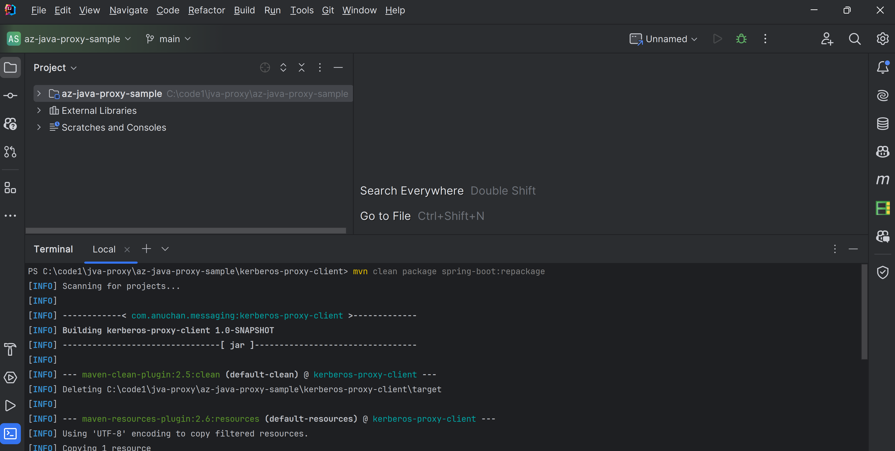
5.	Right-click on the `docker-compose.yml` and select `Run 'docker-compose.yml: …'`
      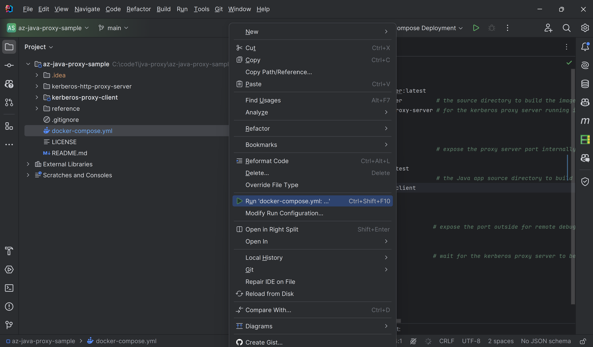
6.	The Services panel should show that both containers as running.
      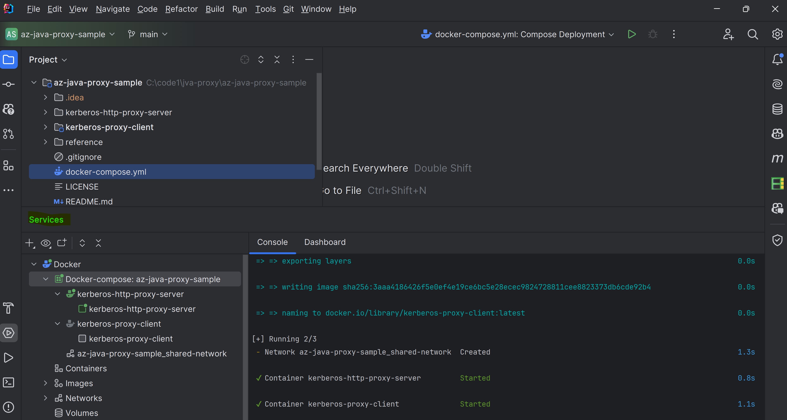
7.	The output of ` kerberos-http-client` container should show that the Java app was able to connect to a http endpoint through the Kerberos proxy.
      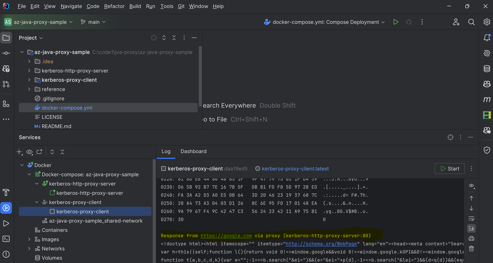
8.	Make sure to stop the services to avoid port conflicts with later runs.
      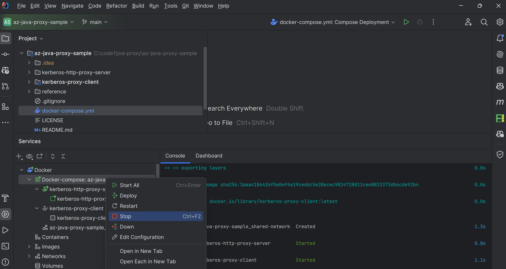
      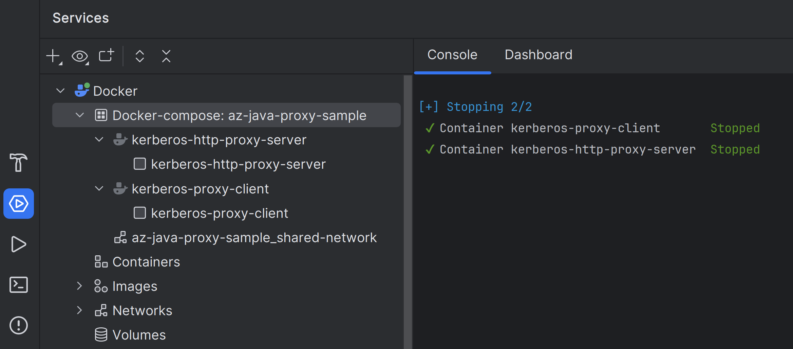
## Debugging the docker services

1.	Update the Docker run configuration (Run -> Edit Configurations) to build the image always so that any code changes get picked. (Note: In case of making code change remember to re-package the Java App before running the docker-compose.yml).
        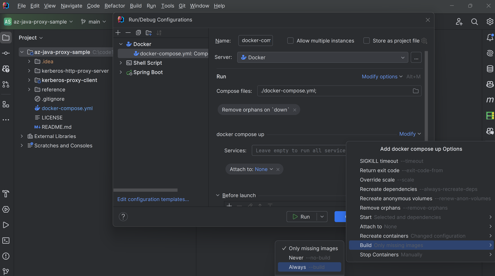
2.	Add a Remote JVM Debug configuration.
      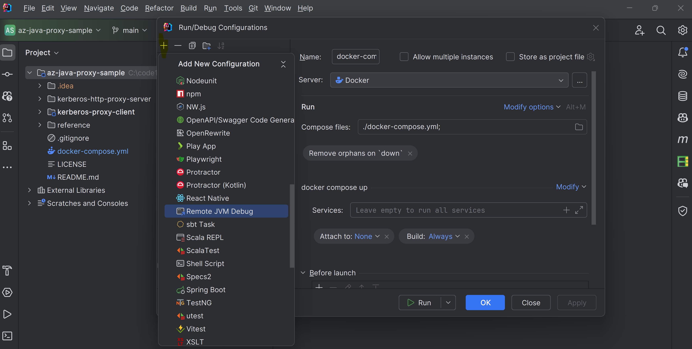
3.	In Remote JVM Debug panel set the debug port to 7777 and `az-java-proxy-sample` as the module class path.
      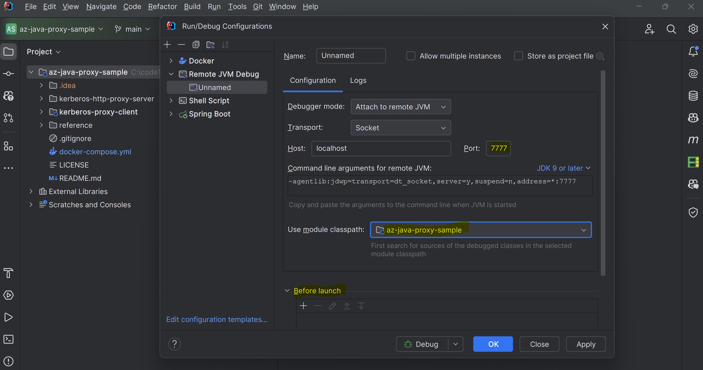
4.	In the Remote JVM Debug Panel add a "Before Lauch" action and choose `docker-compose.yml: Compose Deployment`
      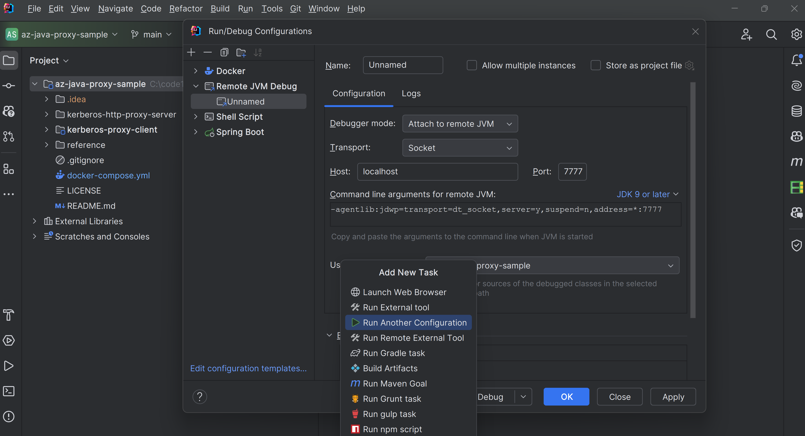 
      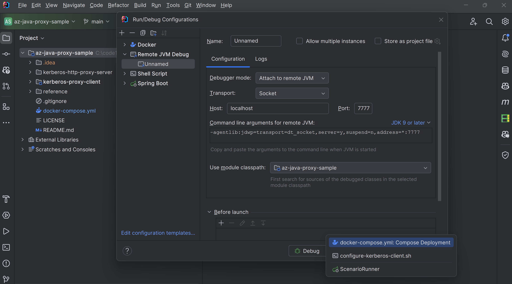
5.	The final Remote JVM Debug Panel should look like this. Click Apply and Ok
      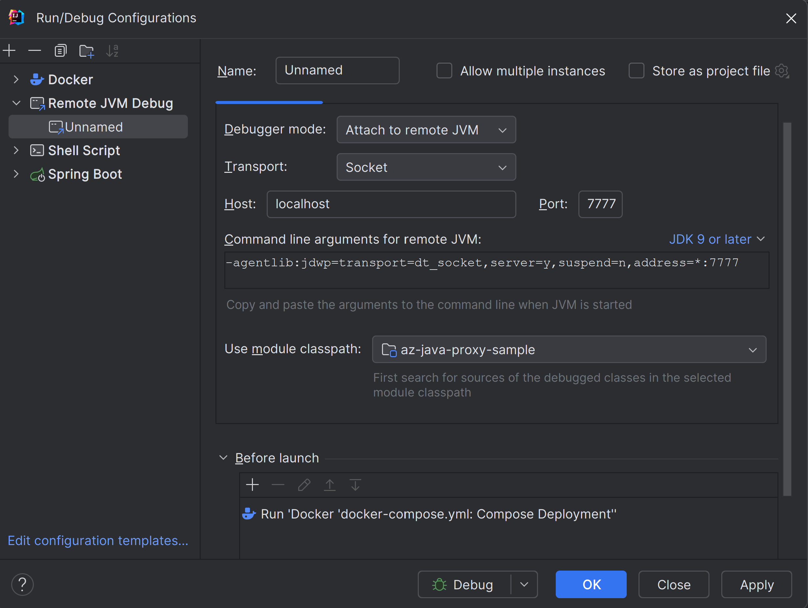
6.	Open any Java File, set a break point, in Remote JVM Debug Panel click Debug.
      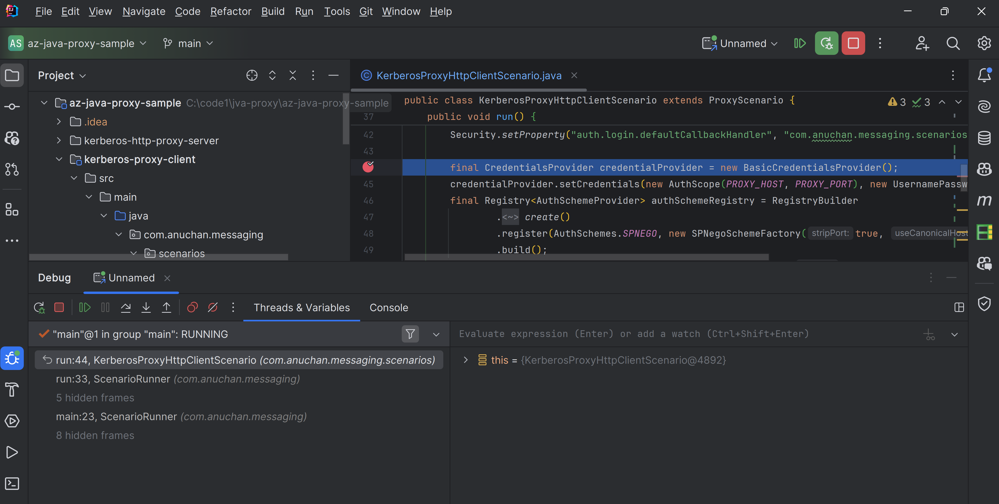

## Credits

For configuring the Kerberos Proxy server I’ve referred to the awesome project [here](https://github.com/microsoft/vscode-proxy-agent)
